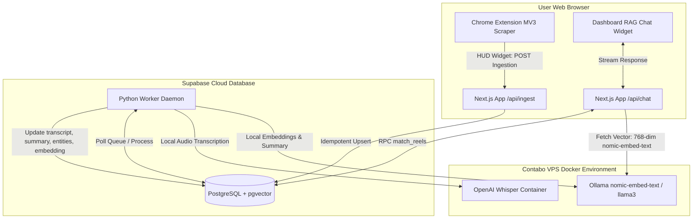

<div align="center">

# 🎬 Reels Second Brain

**A high-performance, open-source system to capture, store, transcribe, summarize, and semantically search every Instagram Reel you've ever saved.**

[](#-license)
[](dashboard/)
[](manifest.json)
[](schema.sql)
[](docker-compose.yml)
[](docker-compose.yml)

<p align="center">
  <a href="#-system-architecture">Architecture</a> •
  <a href="#-deep-dive-mechanisms">Core Mechanisms</a> •
  <a href="#-tech-stack">Tech Stack</a> •
  <a href="#-setup--quick-start">Quick Start</a> •
  <a href="#-database-schema">Database Schema</a> •
  <a href="#-docker-orchestration">Docker Deployment</a>
</p>

</div>

---

## 📖 Project Overview

Instagram lets you save Reels, but it provides no search function, tag filtering, or way to rediscover them. **Reels Second Brain** bridges this gap. 

By combining a lightweight **Chrome Extension (Manifest V3)** for native browser scraping, a **Next.js Web Application** for a sleek glassmorphic dashboard interface and RAG chat widget, a **Supabase PostgreSQL Cloud Database** for indexing, and an **Asynchronous Daemon Engine** (running in **Docker** on a VPS) for downloading, transcribing, and embedding, you get a zero-local-dependency, cost-free AI Second Brain for your saved Reels library.

---

## 🌐 System Architecture

The workflow is designed to run asynchronously. The Chrome Extension adds raw URLs to Supabase, which a Python worker on a VPS polls and enriches. The Next.js app queries both Supabase and the VPS to serve the user.



---

## 🧠 Deep-Dive Mechanisms

### 1. Chrome Extension (Manifest V3) & Dynamic Delta Polling
The Chrome Extension runs natively inside the Instagram Saved posts interface. To bypass arbitrary rate-limiting or loading stalls, it uses a **Dynamic Delta Polling** algorithm:
* **Passive DOM Scanning**: It scans for `/reel/` anchor tags, adding them to a JavaScript `Set` to prevent duplicate operations in memory.
* **Smart Auto-Scrolling**: It triggers page scrolling to load more elements, polling every `200ms`.
* **State Check Engine**: If the catalog size does not increase for `5 seconds`, it verifies if the `scrollHeight` changed. If the height grew, it resets. If it remains identical, it increments a stall counter (hitting `2` stalls signals the true end of the saved catalog).
* **Delta Syncing**: Before starting, the extension fetches already-ingested URLs from the Next.js `/api/latest` endpoint, stopping automatically the moment it encounters an already-synced URL.

### 2. Asynchronous Daemon Engine (Worker)
The Python worker daemon sits in a Docker container on the VPS and runs a continuous polling loop looking for unprocessed reels:
* **Audio Extraction**: Bypasses full video downloads using `yt-dlp` to download the audio track only (saving network, storage, and CPU bandwidth).
* **Robust Transcription**: Sends the audio to local `OpenAI Whisper` for speech-to-text transcription.
* **AI Summarization & Entity Parsing**: Feeds the transcript to a local `llama3` instance inside Ollama to extract summaries, tags, ingredients, recipes, or topics as structured JSON.
* **Embedding Alignment**: Computes a 768-dimensional semantic embedding of the summary using `nomic-embed-text`. If any step fails, it marks the reel as `[FAILED]`, allowing the dashboard user to trigger retries.

### 3. RAG Chat Widget & VPS Vector Network Bypass
The floating Chat widget in the Next.js app provides an interface to query your library.
* **Query Embedding**: To bypass Vercel serverless limitations (Vercel environment restrictions reject local ONNX/Transformers runtimes), the Next.js API route calls the VPS Ollama server (`http://178.18.252.66:11434/api/embeddings`) using standard HTTP `fetch`.
* **Prefixing**: The route prepends `search_query: ` to the search query. This aligns the vector search space with the document index vectors (which are stored with the `search_document: ` prefix prepended by Ollama).
* **Vector Match RPC**: Passes the computed 768-dim vector to the Supabase database. The `match_reels` SQL RPC executes cosine similarity math, matching transcripts and summaries even with a permissive threshold (e.g., `0.01`).
* **Groq streaming**: Returns matching context records and streams them via Groq's `llama-3.1-8b-instant` LLM using Vercel AI SDK streams.

---

## 🛠️ Tech Stack

| Layer | Technology | Description |
|---|---|---|
| **Frontend** | Next.js 16 (App Router) | Premium glassmorphism UI styled with Tailwind CSS 4 |
| **Ingestion Bridge** | Chrome Extension | Manifest V3 content script with Dynamic Delta Polling |
| **Cloud Database** | Supabase | PostgreSQL + `pgvector` extension for semantic indexing |
| **Orchestration** | Docker / Docker Compose | Multi-container system linking Ollama and Python worker |
| **Worker Engine** | Python 3.10 | Downloads audio via `yt-dlp` and processes pipelines |
| **Speech-To-Text** | OpenAI Whisper (Base) | Audio-to-text local translation |
| **AI Summarization** | Ollama (`llama3`) | Local context summaries & JSON entity extraction |
| **Vector Embedding** | Ollama (`nomic-embed-text`) | Local 768-dimensional semantic indexing |
| **LLM Streaming** | Groq (`llama-3.1-8b-instant`) | Vercel AI SDK stream provider |

---

## 🚀 Setup & Quick Start

### Prerequisites
* **Node.js** 18+ and **npm**
* A **Supabase** account
* **Docker** & **Docker Compose** installed on your VPS/server
* **Google Chrome** browser

---

### Step 1 — Database Setup (Supabase)

Log in to your Supabase Console, open the **SQL Editor**, paste the following schema, and click **Run**:

```sql
-- 1. Enable vector extension
CREATE EXTENSION IF NOT EXISTS vector WITH SCHEMA extensions;

-- 2. Create Reels Table
CREATE TABLE IF NOT EXISTS public.reels (
  id                 UUID          PRIMARY KEY DEFAULT gen_random_uuid(),
  original_url       TEXT          NOT NULL UNIQUE,
  video_path         TEXT,
  transcript         TEXT,
  visual_description TEXT,
  ai_summary         TEXT,
  entities           JSONB,
  embedding          vector(768),
  created_at         TIMESTAMPTZ   NOT NULL DEFAULT NOW()
);

-- 3. Create Indexes
CREATE INDEX IF NOT EXISTS idx_reels_created_at ON public.reels (created_at DESC);
CREATE INDEX IF NOT EXISTS idx_reels_entities ON public.reels USING gin (entities);

-- 4. Enable Row Level Security (RLS)
ALTER TABLE public.reels ENABLE ROW LEVEL SECURITY;

CREATE POLICY "Authenticated users have full access to reels"
  ON public.reels FOR ALL USING (auth.role() = 'authenticated') WITH CHECK (auth.role() = 'authenticated');

CREATE POLICY "Allow public read access to reels"
  ON public.reels FOR SELECT USING (true);
```

Next, paste this search RPC function and run it. This function handles the similarity calculations:

```sql
CREATE OR REPLACE FUNCTION match_reels(
  query_embedding  vector(768),
  match_threshold  float,
  match_count      int
)
RETURNS TABLE (
  id                uuid,
  original_url      text,
  transcript        text,
  ai_summary        text,
  entities          jsonb,
  created_at        timestamptz,
  similarity        float
)
LANGUAGE plpgsql
STABLE
SECURITY DEFINER
AS $$
BEGIN
  RETURN QUERY
  SELECT
    r.id,
    r.original_url,
    r.transcript,
    r.ai_summary,
    r.entities,
    r.created_at,
    (1 - (r.embedding <=> query_embedding))::float AS similarity
  FROM   public.reels r
  WHERE
    r.embedding IS NOT NULL
    AND (r.ai_summary IS NULL OR r.ai_summary NOT LIKE '%[FAILED]%')
    AND (1 - (r.embedding <=> query_embedding)) > match_threshold
  ORDER BY
    r.embedding <=> query_embedding
  LIMIT match_count;
END;
$$;

GRANT EXECUTE ON FUNCTION match_reels(vector(768), float, int) TO anon, authenticated, service_role;
```

---

### Step 2 — Install Chrome Extension Scraper

1. In Chrome, open `chrome://extensions/`.
2. Toggle **Developer mode** in the top right.
3. Click **Load unpacked** and select the repository root folder.
4. The 🎬 icon will appear in your extension toolbar.

**How to sync:**
1. Log in to Instagram and navigate to `instagram.com/YOUR_USERNAME/saved/all-posts/`.
2. Click **Sync Library** in the bottom-right HUD widget. The page will auto-scroll, scrape saved Reels, and check them against the database.
3. Click **Download JSON** once the sync completes.

---

### Step 3 — Dashboard Configuration (Next.js)

Clone/move to the `dashboard` directory:

```bash
cd dashboard
cp .env.local.example .env.local
```

Fill in the `.env.local` file with the environment variables from Vercel/Supabase:

```env
# Supabase Configuration
NEXT_PUBLIC_SUPABASE_URL=https://your-project-ref.supabase.co
NEXT_PUBLIC_SUPABASE_ANON_KEY=your-anon-key
SUPABASE_SERVICE_ROLE_KEY=your-secret-service-role-key

# OpenAI / Groq API Configuration
OPENAI_API_KEY=your-groq-api-key
OPENAI_BASE_URL=https://api.groq.com/openai/v1
```

Install packages and run the application:

```bash
npm install
npm run dev
```

The dashboard will be available at `http://localhost:3000`.

---

### Step 4 — Ingesting Data

You can upload the JSON file exported from the Chrome Extension to your database using curl:

```bash
curl -X POST http://localhost:3000/api/ingest \
  -H "Content-Type: application/json" \
  -d @reels-second-brain-sync.json
```

---

## 🐳 Docker Orchestration

To run the AI extraction pipeline (Ollama + Whisper worker daemon) on your VPS or server, configure your variables and spin up the Docker Compose stack.

### 1. Configure Host Environment
Create a `.env` file in the root directory:

```env
SUPABASE_URL=https://your-project-ref.supabase.co
SUPABASE_SERVICE_ROLE_KEY=your-secret-service-role-key
```

### 2. Add Cookies (Optional but Recommended)
If your daemon runs into Instagram login blocks, save your authenticated Instagram session cookies to `worker/cookies.txt`. The container mounts this file automatically to bypass bot detection.

### 3. Spin Up the Stack
Run this command from the root of the project repository:

```bash
docker-compose up -d --build
```

### 4. Pull the Embedding & LLM Models
Initialize Ollama inside the container to download the models required for transcription, summarization, and vector embeddings:

```bash
# Pull the summarization LLM (Llama 3)
docker exec -it rsb-ollama ollama pull llama3

# Pull the vector embedding model (Nomic Embed Text)
docker exec -it rsb-ollama ollama pull nomic-embed-text
```

The Python worker daemon will automatically begin polling Supabase for new reels, extracting their audio, transcribing, summarizing, and writing the computed 768-dimensional embeddings back to the database.

---

## 🗂️ Monorepo Folder Structure

```
reels-second-brain/
├── docker-compose.yml       # Root orchestration config (Ollama + Worker)
├── manifest.json            # Chrome Scraper extension descriptor (Manifest V3)
├── content.js               # HUD overlay script & Dynamic Delta Polling
├── popup.html               # Chrome Extension toolbar popup interface
├── schema.sql               # Supabase Database table layouts & policies
├── supabase_search.sql      # Supabase match_reels RPC vector search function
├── icons/                   # Extension icons (16px, 48px, 128px)
│
├── dashboard/               # Next.js 16 Web Application
│   ├── app/
│   │   ├── api/
│   │   │   ├── chat/        # POST /api/chat — RAG chat handler using VPS Ollama
│   │   │   ├── ingest/      # POST /api/ingest — Scraper payload database bridge
│   │   │   └── latest/      # GET /api/latest — Fetches already-ingested URLs
│   │   ├── components/      # ChatWidget, ReelGrid, ManualAddForm React components
│   │   ├── page.tsx         # Dashboard core layout page
│   │   └── layout.tsx       # Global layouts embedding the chat widget
│   ├── utils/supabase/      # Supabase Server & Client connections
│   ├── next.config.ts       # Clean Next.js configuration
│   └── package.json         # Vercel AI SDK, Supabase SSR, Tailwind configurations
│
└── worker/                  # Asynchronous VPS Pipeline Daemon
    ├── Dockerfile           # Optimized Python slim multi-dependency container
    ├── main.py              # Main loop polling db, transcribing, and embedding
    └── requirements.txt     # Python requirements (yt-dlp, whisper, supabase)
```

---

## 📄 License

This project is open-source software licensed under the **MIT License**. Feel free to use, modify, and distribute it.
