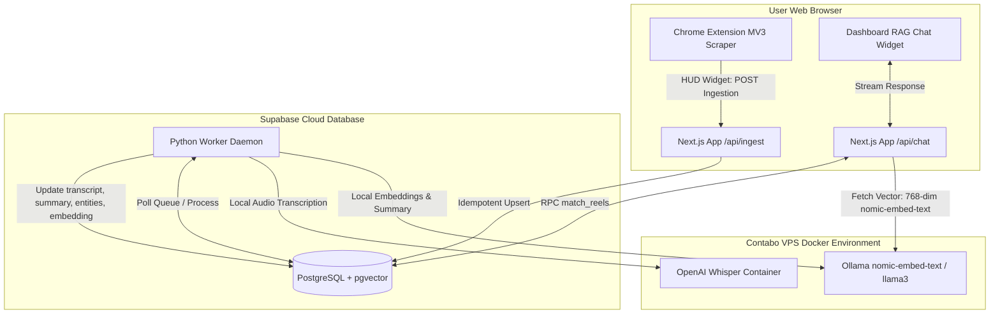

<div align="center">

# 🎬 Instagram Reels Second Brain

**A high-performance, open-source monorepo to capture, store, transcribe, summarize, and semantically search your saved Instagram Reels library.**

[](#-license)
[](dashboard/)
[](extension/)
[](database/)
[](docker-compose.yml)
[](docker-compose.yml)

<p align="center">
  <a href="#-system-architecture">Architecture</a> •
  <a href="#-monorepo-structure">Folder Layout</a> •
  <a href="#-setup--quick-start">Quick Start</a> •
  <a href="#-docker-orchestration">Docker Deployment</a> •
  <a href="#-how-it-works">How It Works</a>
</p>

</div>

---

## 📖 Project Overview

Instagram lets you save Reels, but it provides no search function, tag filtering, or way to browse transcripts and recipes. **Instagram Reels Second Brain** fixes this. 

It uses a hybrid **Cloud-to-VPS** design that avoids heavy local ONNX libraries on the web tier to achieve maximum hosting compatibility (e.g. on Vercel) and instant response times. 

* **Chrome Extension (Manifest V3)**: Run natively in the browser to auto-scroll and scrape your saved Reel library.
* **Next.js Web Dashboard**: Browse your saved reels, filter by AI-extracted category pills, and query transcripts and summaries with a glassmorphic **RAG Chatbox**.
* **Supabase pgvector Database**: Indexes transcripts, metadata entities, and 768-dimensional semantic embeddings.
* **Dockerized Python Background Worker**: Polls Supabase, downloads audio streams, transcribes using OpenAI Whisper, and generates summaries and embeddings via local Ollama instances on your VPS.

---

## 🌐 System Architecture

The monorepo connects your browser, a cloud database, and a VPS background processing pipeline:



---

## 🗂️ Monorepo Structure

```text
reels-second-brain/
├── docker-compose.yml       # Root orchestration config (Ollama + Python Worker)
├── README.md                # Premium repo documentation & landing page
├── .gitignore               # Configured git ignore policies for monorepo
│
├── 📂 database/             # Supabase DB schema definitions
│   ├── schema.sql           # Table structure, indices, and RLS security rules
│   └── supabase_search.sql  # Cosine similarity match_reels RPC vector function
│
├── 📂 extension/            # Chrome Extension (Manifest V3 Scraper)
│   ├── manifest.json        # Extension manifest and permission settings
│   ├── content.js           # HUD widget & Dynamic Delta Polling scraper script
│   ├── popup.html           # Toolbar popup instructions interface
│   └── icons/               # Extension icons (16px, 48px, 128px)
│
├── 📂 dashboard/            # Next.js 16 Web Dashboard & Chatbot
│   ├── app/
│   │   ├── api/
│   │   │   ├── chat/        # POST /api/chat — RAG chat API (VPS Ollama bypass)
│   │   │   ├── ingest/      # POST /api/ingest — Ingestion bridge endpoint
│   │   │   └── latest/      # GET /api/latest — Delta sync checklist fetcher
│   │   ├── components/      # ChatWidget, ReelGrid, ManualAddForm React components
│   │   ├── page.tsx         # Dashboard main page
│   │   └── layout.tsx       # Global layout containing the floating chat widget
│   ├── utils/supabase/      # Server, Browser, and service_role Supabase clients
│   ├── next.config.ts       # Clean Next.js configuration
│   └── package.json         # Pruned server dependencies (Vercel AI SDK, Zod)
│
└── 📂 worker/               # Asynchronous VPS Pipeline Daemon
    ├── Dockerfile           # Optimized Python slim container configuration
    ├── main.py              # Main loop polling db, transcribing, and embedding
    └── requirements.txt     # Python requirements (yt-dlp, whisper, supabase)
```

---

## 🔌 How It Works

### Chrome Extension (Manifest V3)
Loads onto `instagram.com/*/saved/all-posts/` and inserts a HUD widget. 
1. **Delta Syncing**: It calls the Next.js `/api/latest` endpoint to fetch already-ingested Reel URLs.
2. **Dynamic Delta Polling**: Auto-scrolls page down and polls for new visible anchor tags every `200ms`. The moment the catalog stops growing, it scroll-checks. If nothing changes for `5` seconds, it triggers a retry, stopping after `2` consecutive stalls. Syncing halts instantly if an already-saved URL is matched.
3. **Idempotent Ingestion**: Yields a clean JSON catalog and POSTs it directly to the dashboard ingestion bridge, avoiding duplicates.

### Asynchronous Daemon Engine (worker)
Runs inside Docker on your VPS:
1. **Audio Poller**: Queries Supabase for rows with null `ai_summary` fields.
2. **Download & Extract**: Downloads only the audio stream of the reel via `yt-dlp` to save bandwidth and disk space.
3. **Speech-to-Text**: Passes the audio track to local `OpenAI Whisper` for local transcription.
4. **Summary & Entities**: Sends the transcript to local Ollama (`llama3`) to output a summary and structure entities (e.g. tags, cuisine, topics, ingredients).
5. **Compute Vectors**: Submits the summary to local Ollama (`nomic-embed-text`) to generate a 768-dim embedding and updates Supabase.

### RAG Chat Widget
Built using Vercel AI SDK on the dashboard:
1. **VPS Vector Network Bypass**: Next.js POST endpoint receives the message, prepends `search_query: `, and calls the VPS Ollama instance over HTTP to calculate the query vector. This bypasses Vercel's serverless package constraints.
2. **Vector Match RPC**: Passes the vector to Supabase's `match_reels` RPC utilizing a permissive threshold (`0.01`).
3. **Groq Context Streaming**: Context strings (URL, summary, transcript) are matched and streamed back to the browser via Groq's `llama-3.1-8b-instant`.

---

## 🚀 Setup & Quick Start

### Step 1 — Database Configuration (Supabase)
In your Supabase **SQL Editor**, run the script inside [database/schema.sql](database/schema.sql) to initialize the table:

```sql
CREATE EXTENSION IF NOT EXISTS vector WITH SCHEMA extensions;

CREATE TABLE IF NOT EXISTS public.reels (
  id                 UUID          PRIMARY KEY DEFAULT gen_random_uuid(),
  original_url       TEXT          NOT NULL UNIQUE,
  video_path         TEXT,
  transcript         TEXT,
  visual_description TEXT,
  ai_summary         TEXT,
  entities           JSONB,
  embedding          vector(768),
  created_at         TIMESTAMPTZ   NOT NULL DEFAULT NOW()
);

CREATE INDEX IF NOT EXISTS idx_reels_created_at ON public.reels (created_at DESC);
CREATE INDEX IF NOT EXISTS idx_reels_entities ON public.reels USING gin (entities);

ALTER TABLE public.reels ENABLE ROW LEVEL SECURITY;

CREATE POLICY "Authenticated users have full access to reels"
  ON public.reels FOR ALL USING (auth.role() = 'authenticated') WITH CHECK (auth.role() = 'authenticated');

CREATE POLICY "Allow public read access to reels"
  ON public.reels FOR SELECT USING (true);
```

Then, run [database/supabase_search.sql](database/supabase_search.sql) to create the vector matching function:

```sql
CREATE OR REPLACE FUNCTION match_reels(
  query_embedding  vector(768),
  match_threshold  float,
  match_count      int
)
RETURNS TABLE (
  id                uuid,
  original_url      text,
  transcript        text,
  ai_summary        text,
  entities          jsonb,
  created_at        timestamptz,
  similarity        float
)
LANGUAGE plpgsql
STABLE
SECURITY DEFINER
AS $$
BEGIN
  RETURN QUERY
  SELECT
    r.id,
    r.original_url,
    r.transcript,
    r.ai_summary,
    r.entities,
    r.created_at,
    (1 - (r.embedding <=> query_embedding))::float AS similarity
  FROM   public.reels r
  WHERE
    r.embedding IS NOT NULL
    AND (r.ai_summary IS NULL OR r.ai_summary NOT LIKE '%[FAILED]%')
    AND (1 - (r.embedding <=> query_embedding)) > match_threshold
  ORDER BY
    r.embedding <=> query_embedding
  LIMIT match_count;
END;
$$;

GRANT EXECUTE ON FUNCTION match_reels(vector(768), float, int) TO anon, authenticated, service_role;
```

---

### Step 2 — Chrome Extension Scraper Setup
1. In Chrome, open `chrome://extensions/`.
2. Turn on **Developer mode** in the top right.
3. Click **Load unpacked** and select the [extension/](extension/) folder.
4. Go to `instagram.com/YOUR_USERNAME/saved/all-posts/` and click **Sync Library** in the bottom-right widget.

---

### Step 3 — Dashboard Configuration (Next.js)
Clone/move to the `dashboard` directory:

```bash
cd dashboard
cp .env.local.example .env.local
```

Fill in the `.env.local` file with the environment variables from Vercel/Supabase:

```env
NEXT_PUBLIC_SUPABASE_URL=https://your-project-ref.supabase.co
NEXT_PUBLIC_SUPABASE_ANON_KEY=your-anon-key
SUPABASE_SERVICE_ROLE_KEY=your-secret-service-role-key

OPENAI_API_KEY=your-groq-api-key
OPENAI_BASE_URL=https://api.groq.com/openai/v1
```

Install packages and run the application:

```bash
npm install
npm run dev
```

---

## 🐳 Docker Orchestration

The pipeline (Ollama + Whisper worker daemon) is fully containerized.

### 1. Configure Host Environment
Create a `.env` file in the root directory:

```env
SUPABASE_URL=https://your-project-ref.supabase.co
SUPABASE_SERVICE_ROLE_KEY=your-secret-service-role-key
```

### 2. Save Instagram Session Cookies (Optional)
Save your authenticated Instagram cookies to `worker/cookies.txt`. This enables `yt-dlp` to bypass login blocks on private reels.

### 3. Spin Up the Stack
Run this command from the root of the project repository:

```bash
docker-compose up -d --build
```

### 4. Download LLM Models
Pull the local LLM and embedding models inside the Ollama container:

```bash
# Pull the summarization LLM (Llama 3)
docker exec -it rsb-ollama ollama pull llama3

# Pull the vector embedding model (Nomic Embed Text)
docker exec -it rsb-ollama ollama pull nomic-embed-text
```

The daemon will start parsing your reels queue asynchronously!

---

## 📄 License

MIT License. Free to use, modify, and distribute.
